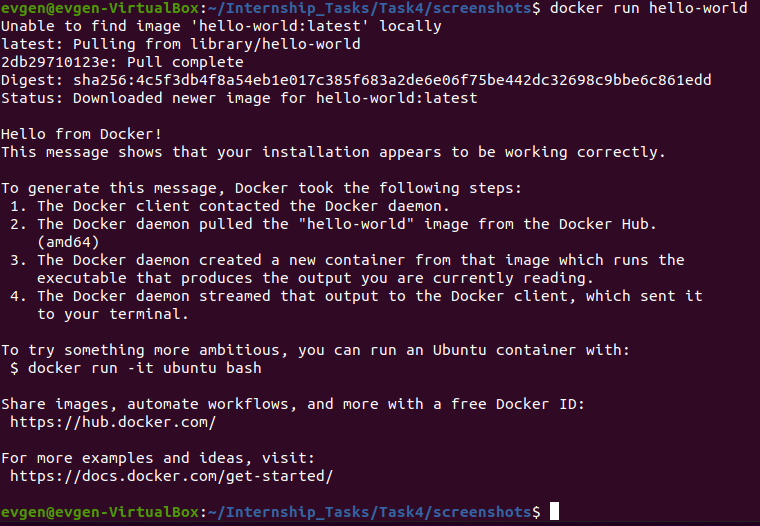
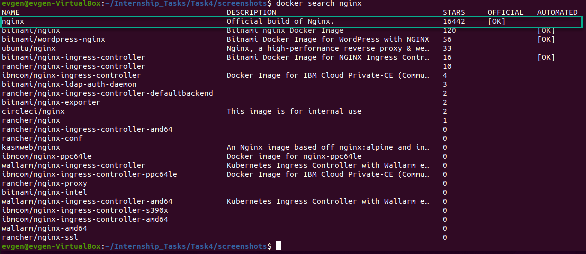
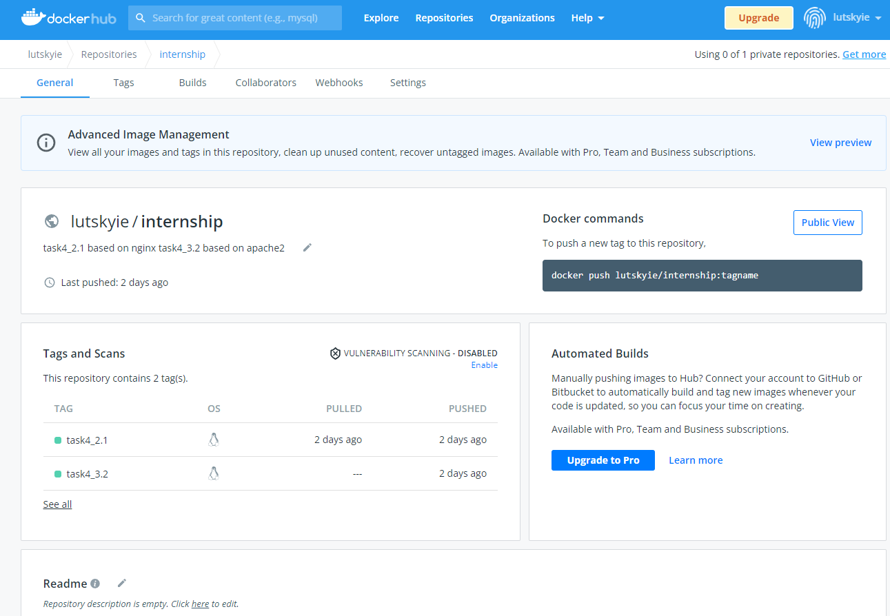
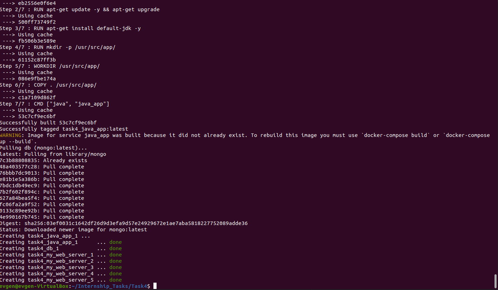

1 and Extra 1.1.   
I used this script to install docker:  
  
	#!/bin/bash  
	sudo apt update  
	sudo apt install apt-transport-https  
	curl -fsSL https://download.docker.com/linux/ubuntu/gpg | sudo apt-key add -  
	sudo add-apt-repository "deb [arch=amd64] https://download.docker.com/linux/ubuntu $(lsb_release -cs) stable"  
	sudo apt update  
	sudo apt install docker-ce  
  
2. To test the program, I used command "docker run hello-world". The result of this command in the picture below  
  
  
Extra 2.1.   
For this task, I used the image nginx. To find this image I used command "docker search nginx".  
  
After running the image by command "docker run -d -p 3000:80 nginx", I connected to the container with the command   "docker exec -it d74567b894f5 /bin/bash". Then I changed the file in the path "/etc/nginx/html/index.html" to output "Yevhen 2022". After that I create an image by "docker commit 5dbafa67ecd3 nginx:task_2.1" command.  
  
3.1 and Extra 3.1.1.  
For this task I used this Dockerfile:  
	ROM ubuntu:18.04  
	RUN apt-get update -y  
	RUN apt-get install apache2 -y  
	ENV DEVOPS=Yevhen  
	RUN echo "DEVOPS=$DEVOPS" > /var/www/html/index.html  
	CMD ["/usr/sbin/apache2ctl", "-DFOREGROUND"]  
	EXPOSE 80  
	  
4. After creating the image in task 3 I pushed it to my docker hub repository.  
  
5. For task 5 i used the following docker compose file:  
       version: "3.9"  
       volumes:  
         db_volume:  
  
       services:  
         my_web_server:  
           image: lutskyie/internship:task4_3.2  
           deploy:  
            replicas: "5"  
           ports:  
            - 3000-3005:80  
         java_app:  
           build: app/  
         db:  
           image: mongo:latest  
           volumes:  
            - db_volume:/data/db  
              
The result of executing this file is in the screenshot below.  
  

