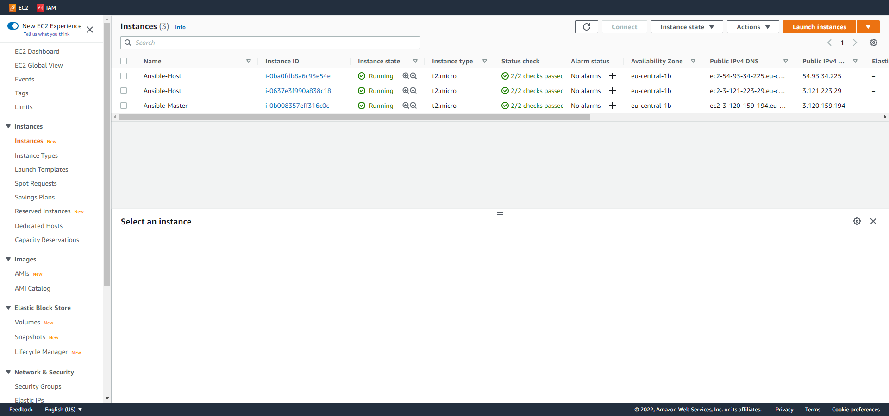

1. For deploying virtual machines I used AWS Console.  
  
After starting the instances I connected to Ansible-Master by SSH and installed Ansible.  
To install i used the following commands:  
	sudo apt-add-repository ppa:ansible/ansible  
	sudo apt-get update  
	sudo apt-get install ansible -y  
2. To chek ping with other instances I used the following command:  
	ansible task5 -m ping  
task5 is the host group name in my ansible.cfg file.  
  
3. To complete this part of the task I wrote playbook file named "docker_inst.yaml". I also wrote a script which I then used in playbook file.  
To execute this playbook, I used the command:  
	ansible-playbook docker_inst.yaml  
The result of running this command is shown below.  
  

  

  
